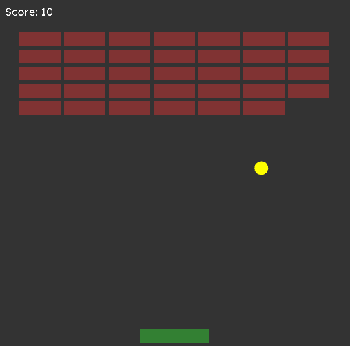

# vexed 
A small library for making 2D applications with OpenGL

# Demo
```cpp
#include "vexed/application.h"
#include <cmath>

using namespace vexed;

Font font;

void onLoad(Application *application) {
    application->getGraphics()->setClearColor(Color(0.2f, 0.2f, 0.2f, 0.2f));
    
    //Fonts are not included so make sure to get your own
    font.load("../data/fonts/Roboto-Regular.ttf", 64);
}

void onClose(Application *application) {
    font.destroy();
}

void onUpdate(Application *application) {
    auto graphics = application->getGraphics();
    
    Viewport viewport = graphics->getViewport();

    Vector3 position(10, 10, -1.0f);
    Vector2 size(viewport.width - 20, viewport.height - 20);
    
    //Z component is used for depth (range is -1.0 to 1.0)
    graphics->addRectangle(position, size, Color::orange());
    
    Rectangle clippingRect(position.x, position.y, size.x, size.y);
    graphics->addText(Vector3(15, 15, 0), &font, "Hello world", 32, Color::black(), clippingRect);

    static float elapsedTime = 0.0f;

    Vector3 center(viewport.width * 0.5f, viewport.height * 0.5f, 0.1);
    graphics->addCircle(center, 50.0f, 5, elapsedTime * 100, Color(80, 80, 80, 127));

    elapsedTime += application->getDeltaTime();
}

int main() {
    Configuration config;
    config.flags = WindowFlags_VSync;
    config.title = "Vexed Demo";
    config.width = 512;
    config.height = 512;
    config.iconData = nullptr;
    config.iconDataSize = 0;

    Application application(config);
    application.load = onLoad;
    application.close = onClose;
    application.update = onUpdate;
    application.run();
}
```

# Example application
 
